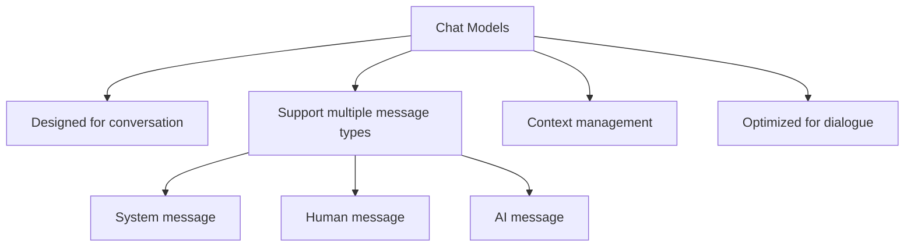
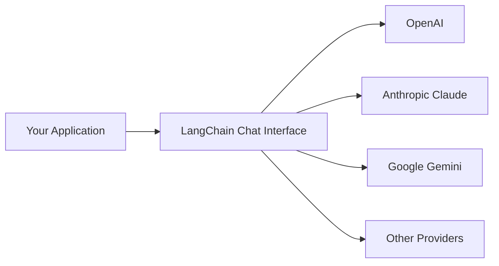
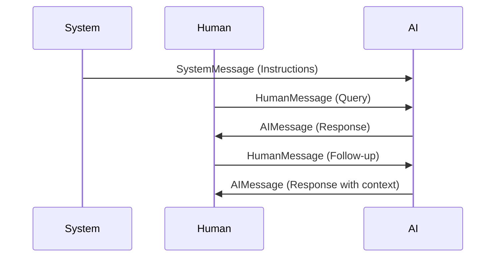
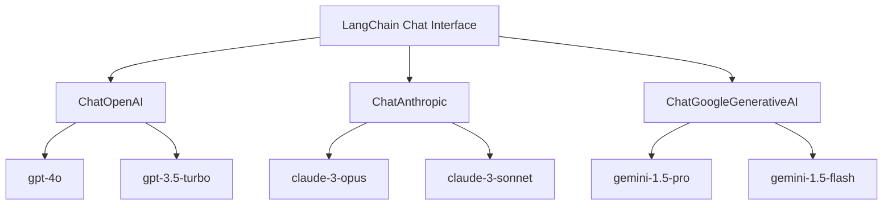
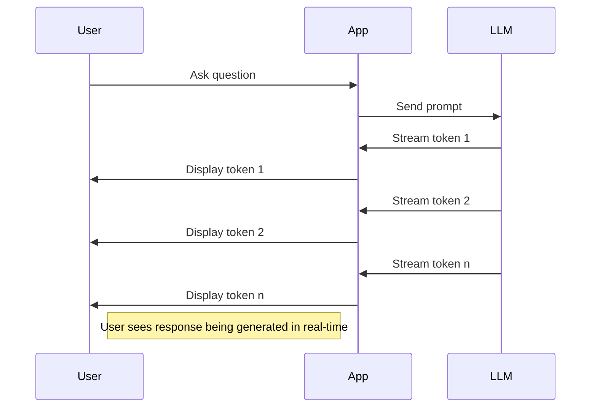
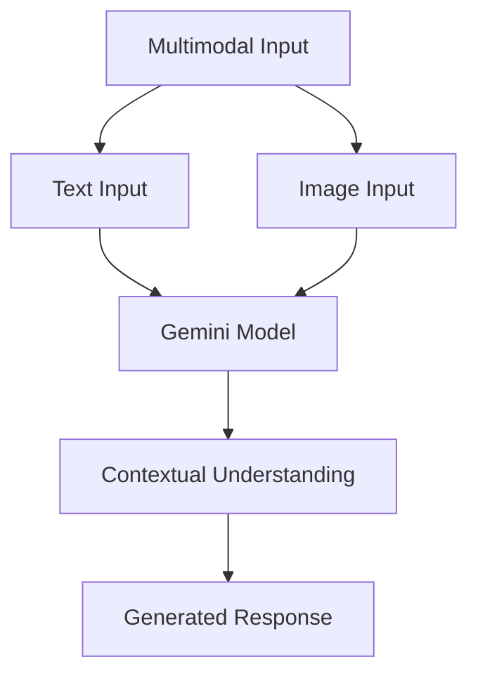

# LangChain Chat Models

This directory contains examples of working with LangChain's chat model abstractions, demonstrating various ways to interact with Large Language Models (LLMs).

## What are Chat Models?

Chat models are specialized language models optimized for conversational interactions. Unlike traditional completion-based models, chat models:

- Maintain conversation context
- Support multi-turn dialogues
- Use structured message formats (system, user, assistant)
- Are fine-tuned for helpful, accurate, and safe responses



## Why Use LangChain's Chat Model Interface?

LangChain provides a unified interface to work with various chat model providers:

1. **Provider Flexibility**: Switch between different LLM providers (OpenAI, Anthropic, Google) with minimal code changes
2. **Simplified API**: Consistent methods and data structures across providers
3. **Advanced Features**: Built-in support for message history, structured prompting, and more
4. **Extensibility**: Easy integration with other LangChain components like chains, agents, and memory systems



## Core Concepts

### Message Types

LangChain structures conversations using different message types:

- **SystemMessage**: Instructions that prime the behavior of the AI assistant
- **HumanMessage**: Messages from the user/human
- **AIMessage**: Responses generated by the AI

### Chat History

Chat history is managed as a sequence of messages. This enables:

- Context retention across turns
- Reasoning based on previous exchanges
- Natural multi-turn conversations



## Examples in this Directory

### 1. Basic Chat Model (`1_chat_model_basic.py`)

This script demonstrates the simplest way to interact with a chat model. It:

- Imports a chat model (Google Gemini)
- Sends a single query
- Displays the full response and content

```python
model = ChatGoogleGenerativeAI(model="gemini-1.5-flash")
result = model.invoke("What is 100 divided by 10?")
print(result.content)  # Output: 10
```

### 2. Basic Conversation (`2_chat_model_basic_conversation.py`)

Shows how to construct a conversation using different message types:

- SystemMessage for initial instructions
- HumanMessage for user queries
- AIMessage for assistant responses
- Demonstrates how context is maintained between messages

### 3. Alternative Providers (`3_chat_model_alternatives.py`)

Illustrates how to use different LLM providers with the same interface:

- OpenAI (GPT models)
- Anthropic (Claude models)
- Google (Gemini models)



### 4. Interactive Conversation (`4_chat_model_conversation_with_user.py`)

Demonstrates a real-time chat application that:

- Takes user input via the console
- Maintains conversation history
- Provides AI responses in a chat-like format
- Shows how to implement a practical chat loop

### 5. Persistent Chat History (`5_chat_model_save_message_history_firebase.py`)

Shows how to store and retrieve chat history from a database:

- Uses Google Firestore for persistence
- Demonstrates how to initialize and load previous conversation history
- Allows conversations to persist between sessions

### 6. Streaming Responses (`6_chat_model_streaming.py`)

Demonstrates how to stream responses from Gemini models:

- Shows token-by-token generation
- Illustrates how to process streaming responses
- Compares streaming vs. non-streaming approaches



### 7. Model Parameters (`7_chat_model_parameters.py`)

Explores how different model parameters affect Gemini outputs:

- Demonstrates temperature adjustments for creativity control
- Shows how to modify top_p (nucleus sampling)
- Illustrates limiting output length with max_output_tokens
- Compares parameter effects on different query types

### 8. Multimodal Capabilities (`8_chat_model_multimodal.py`)

Showcases Gemini's ability to process both text and images:

- Demonstrates image analysis and understanding
- Shows how to format multimodal messages
- Illustrates conversations with image context
- Provides examples of practical multimodal applications



### 9. Error Handling and Retries (`9_chat_model_error_handling.py`)

Demonstrates robust error handling strategies:

- Shows basic error handling with try-except
- Implements retry mechanisms with exponential backoff
- Handles parsing errors with graceful fallbacks
- Illustrates content moderation error handling
- Provides best practices for production deployments

## Usage Guidelines

### When selecting a model:

1. **Cost considerations**: Different models have different pricing structures

   - Gemini Flash: Lower cost, faster
   - GPT-4o: Higher cost, more capable
   - Claude 3 Opus: High cost, highest capabilities

2. **Performance needs**:

   - Complex reasoning: GPT-4o, Claude 3 Opus
   - Quick responses: Gemini Flash
   - General purpose: Claude 3 Sonnet, Gemini Pro

3. **Context window requirements**:
   - Claude models: Up to 200K tokens
   - GPT-4 Turbo: Up to 128K tokens
   - Gemini models: Variable ranges

## Getting Started

To run these examples:

1. Install the required packages:

   ```bash
   pip install langchain langchain-google-genai langchain-anthropic langchain-openai python-dotenv google-cloud-firestore
   ```

2. Set up environment variables in a `.env` file:

   ```
   OPENAI_API_KEY=your_openai_key_here
   ANTHROPIC_API_KEY=your_anthropic_key_here
   GOOGLE_API_KEY=your_google_api_key_here
   ```

3. For the Firebase example, set up Google Cloud credentials as mentioned in the script comments.

4. Run any example:
   ```bash
   python 1_chat_model_basic.py
   ```

## Best Practices

1. **Use system messages** to set the tone and expectations for the AI assistant
2. **Keep message history manageable** to avoid token limit issues
3. **Handle errors gracefully** as API calls may occasionally fail
4. **Consider caching** responses for commonly asked questions
5. **Test with different providers** to find the best model for your specific use case
