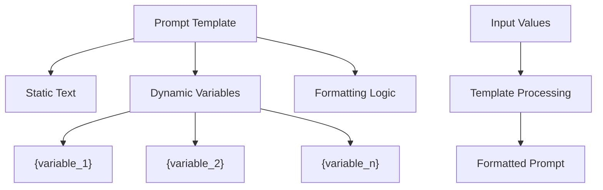
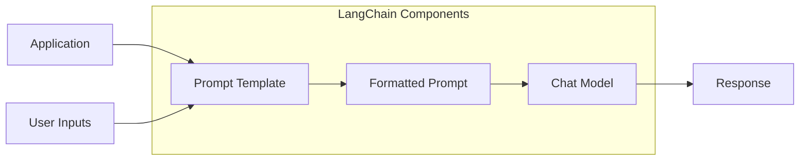
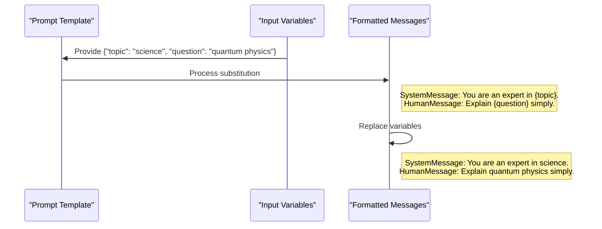
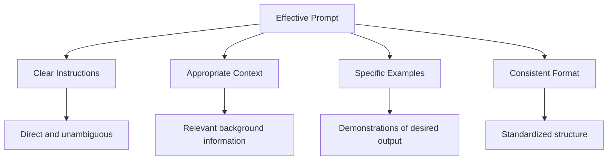
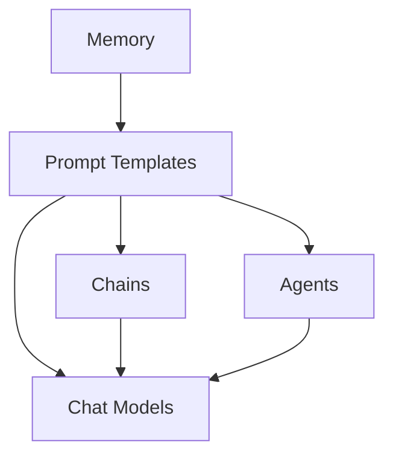

# LangChain Prompt Templates

This directory contains examples of working with LangChain's prompt template system, demonstrating how to create structured, reusable prompts for language models.

## What are Prompt Templates?

Prompt templates are reusable structures for generating prompts with variable components. They allow you to:

- Create standardized prompt formats
- Insert dynamic values into predefined placeholders
- Maintain consistent prompt structures across applications
- Separate prompt engineering from application logic



## Why Use LangChain's Prompt Templates?

1. **Modularity**: Separate prompt design from application code
2. **Reusability**: Create prompts once and reuse them with different inputs
3. **Maintainability**: Update prompt structures in one place
4. **Composition**: Combine templates with other LangChain components
5. **Type Safety**: Ensure all required variables are provided



## Core Concepts

### Template Types

LangChain provides several types of prompt templates:

- **ChatPromptTemplate**: For structured chat messages
- **PromptTemplate**: For simple text prompts
- **FewShotPromptTemplate**: For prompts with examples
- **StringPromptTemplate**: Base class for custom templates

### Variable Substitution

Templates use curly braces `{variable_name}` to mark where dynamic values should be inserted:

```python
template = "Tell me a {adjective} story about {animal}."
```

When the template is rendered with values like `{"adjective": "funny", "animal": "panda"}`, it produces:

```
Tell me a funny story about panda.
```

### Message Types

Chat templates support different message types:

- `system`: Sets context and behavior instructions
- `human`: Represents user input
- `ai`: Represents assistant responses



## Examples in this Directory

### 1. Basic Prompt Templates (`1_prompt_template_basic.py`)

This script demonstrates:

- Creating simple templates with placeholders
- Working with multiple variables
- Using tuples to define system and human messages
- Common patterns and pitfalls

Example from the code:

```python
template = "Tell me a joke about {topic}."
prompt_template = ChatPromptTemplate.from_template(template)
prompt = prompt_template.invoke({"topic": "cats"})
```

### 2. Templates with Chat Models (`2_prompt_template_with_chat_model.py`)

Shows how to:

- Combine templates with language models
- Create multi-message conversations
- Leverage system messages for setting assistant behavior
- Pass multiple variables to complex templates

Example from the code:

```python
messages = [
    ("system", "You are a comedian who tells jokes about {topic}."),
    ("human", "Tell me {joke_count} jokes."),
]
prompt_template = ChatPromptTemplate.from_messages(messages)
prompt = prompt_template.invoke({"topic": "lawyers", "joke_count": 3})
result = model.invoke(prompt)
```

## Prompt Engineering Best Practices

### Structure



1. **Be specific**: Clearly define the task and expected output format
2. **Provide context**: Include necessary background information
3. **Use examples**: Demonstrate the desired output with examples
4. **Control tone**: Use system messages to set the assistant's style
5. **Break down complex tasks**: Use step-by-step instructions

### Template Variables

1. **Choose descriptive names**: Use variable names that clearly indicate their purpose
2. **Consider defaults**: Provide default values for optional variables
3. **Validate inputs**: Ensure values match expected types and constraints
4. **Document requirements**: Clearly document what each variable represents

## Advanced Usage

### Few-shot Learning

Use examples to teach the model the desired pattern:

```python
examples = [
    {"input": "happy", "output": "sad"},
    {"input": "tall", "output": "short"},
]

few_shot_template = FewShotPromptTemplate(
    examples=examples,
    example_prompt=PromptTemplate(input_variables=["input", "output"], template="Input: {input}\nOutput: {output}"),
    prefix="Find the opposite of each word:",
    suffix="Input: {adjective}\nOutput:",
    input_variables=["adjective"]
)
```

### Conditional Templates

Use different template variations based on conditions:

```python
def get_template(user_type):
    if user_type == "technical":
        return "Explain {concept} in technical detail."
    else:
        return "Explain {concept} in simple terms."
```

## Getting Started

To run these examples:

1. Install the required packages:

   ```bash
   pip install langchain langchain-google-genai python-dotenv
   ```

2. Set up environment variables in a `.env` file:

   ```
   GOOGLE_API_KEY=your_google_api_key_here
   ```

3. Run any example:
   ```bash
   python 1_prompt_template_basic.py
   ```

## Integration with Other LangChain Components

Prompt templates are designed to integrate seamlessly with:

- **Chat Models**: Send formatted prompts to LLMs
- **Chains**: Use as input components in processing pipelines
- **Agents**: Define behavior and tasks for autonomous systems
- **Memory**: Store and retrieve conversation history



## Best Practices

1. **Iterate and refine**: Continuously improve prompts based on model outputs
2. **Test variations**: Try different phrasings to find optimal results
3. **Version control**: Track changes to prompts as you refine them
4. **Reuse common patterns**: Build a library of effective template patterns
5. **Balance precision and flexibility**: Make templates specific enough to guide the model but flexible enough to handle various inputs
