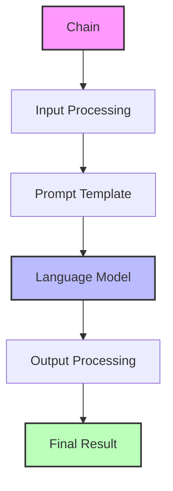
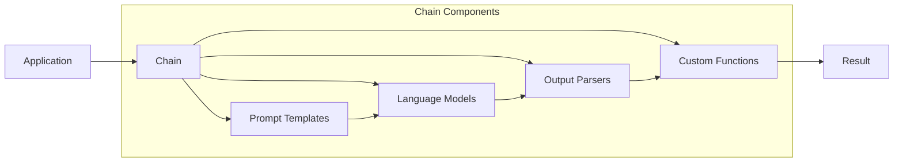
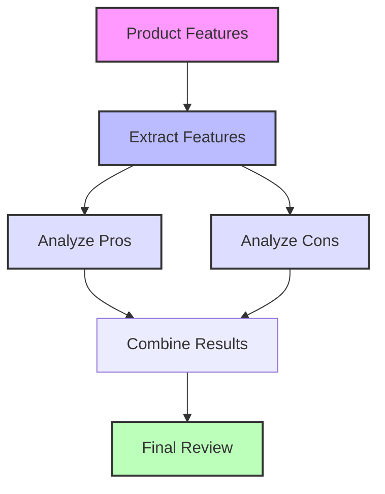
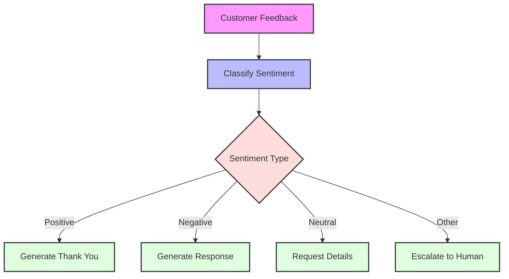
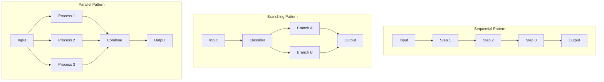

# LangChain Chains

This directory contains examples demonstrating how to use LangChain's chains to create powerful, composable workflows that combine language models with other components.

## What are LangChain Chains?

Chains in LangChain are sequences of components that can be connected together to create complex, multi-step AI workflows. They allow you to:

- Combine multiple LLM calls in sequence
- Process inputs and outputs through custom functions
- Create branching logic based on model outputs
- Execute operations in parallel
- Build reusable, maintainable, and testable AI applications



## Why Use LangChain Chains?

1. **Composition**: Build complex applications by combining simple, reusable components
2. **Abstraction**: Hide implementation details behind interfaces
3. **Flexibility**: Swap components without changing the overall structure
4. **Debugging**: Track and debug each step in the process
5. **Scalability**: Start simple and add complexity as needed



## Core Concepts

### LangChain Expression Language (LCEL)

LCEL is a declarative way to compose chains using the pipe (`|`) operator, making it easy to create readable and maintainable chains.

```python
chain = prompt_template | model | StrOutputParser()
```

This compact syntax connects components in a readable way:

1. Format a prompt template with user inputs
2. Send the formatted prompt to an LLM
3. Parse the model's response into a string

### Runnable Interface

All chain components implement a common `Runnable` interface with methods like:

- `invoke()`: Process a single input
- `batch()`: Process multiple inputs in parallel
- `stream()`: Stream partial results as they become available
- `ainvoke()`: Asynchronous version of invoke()

### Chain Types

LangChain provides several built-in chain types:

- **Sequential Chains**: Execute steps in order
- **Parallel Chains**: Execute multiple branches simultaneously
- **Branching Chains**: Choose different paths based on conditions
- **Custom Chains**: Create your own chain logic

## Examples in this Directory

### 1. Basic Chains (`1_chains_basics.py`)

Demonstrates the simplest way to create a chain using LCEL:

```python
# Create the combined chain using LangChain Expression Language (LCEL)
chain = prompt_template | model | StrOutputParser()

# Run the chain
result = chain.invoke({"topic": "lawyers", "joke_count": 3})
```

This example shows how to:

- Connect a prompt template, model, and output parser
- Pass variables to a chain
- Get a processed result

### 2. Under the Hood (`2_chains_under_the_hood.py`)

Explores how chains work internally by using `RunnableLambda` and `RunnableSequence`:

```python
# Create individual runnables (steps in the chain)
format_prompt = RunnableLambda(lambda x: prompt_template.format_prompt(**x))
invoke_model = RunnableLambda(lambda x: model.invoke(x.to_messages()))
parse_output = RunnableLambda(lambda x: x.content)

# Create the RunnableSequence (equivalent to the LCEL chain)
chain = RunnableSequence(first=format_prompt, middle=[invoke_model], last=parse_output)
```

This example:

- Breaks down each step in a chain
- Shows how to use `RunnableLambda` for custom logic
- Explains the equivalence between LCEL and `RunnableSequence`

### 3. Extended Chains (`3_chains_extended.py`)

Shows how to add custom processing steps to a chain:

```python
# Define additional processing steps using RunnableLambda
uppercase_output = RunnableLambda(lambda x: x.upper())
count_words = RunnableLambda(lambda x: f"Word count: {len(x.split())}\n{x}")

# Create the combined chain using LangChain Expression Language (LCEL)
chain = prompt_template | model | StrOutputParser() | uppercase_output | count_words
```

This example demonstrates:

- Adding post-processing steps to model outputs
- Transforming data between chain components
- Building longer chains with multiple operations

### 4. Parallel Chains (`4_chains_parallel.py`)

Illustrates how to execute multiple operations in parallel using `RunnableParallel`:



```python
# Create parallel branches with RunnableParallel
chain = (
    prompt_template
    | model
    | StrOutputParser()
    | RunnableParallel(branches={"pros": pros_branch_chain, "cons": cons_branch_chain})
    | RunnableLambda(lambda x: combine_pros_cons(x["branches"]["pros"], x["branches"]["cons"]))
)
```

This example shows how to:

- Split processing into multiple parallel branches
- Process the same input in different ways
- Recombine results from parallel operations

### 5. Branching Chains (`5_chains_branching.py`)

Demonstrates conditional logic in chains using `RunnableBranch`:



```python
# Define the runnable branches for handling feedback
branches = RunnableBranch(
    (lambda x: "positive" in x, positive_feedback_template | model | StrOutputParser()),
    (lambda x: "negative" in x, negative_feedback_template | model | StrOutputParser()),
    (lambda x: "neutral" in x, neutral_feedback_template | model | StrOutputParser()),
    escalate_feedback_template | model | StrOutputParser(),  # Default branch
)
```

This example shows how to:

- Create decision points in a chain
- Execute different logic based on conditions
- Use a default branch for fallback handling

## Designing Effective Chains

### Chain Architecture Patterns



1. **Atomic Components**: Design each component to do one thing well
2. **Clear Interfaces**: Define explicit input/output contracts
3. **Error Handling**: Add validation and error recovery
4. **Performance Considerations**: Be aware of latency in multi-step chains
5. **Testing**: Test components individually before combining them

## Advanced Concepts

### Dynamic Chains

Chains can be modified at runtime based on context:

```python
def get_chain_for_user(user_profile):
    if user_profile["expertise"] == "expert":
        return expert_chain
    else:
        return beginner_chain

chain = get_chain_for_user(current_user)
result = chain.invoke(user_input)
```

### Creating Feedback Loops

Chains can incorporate feedback loops for iterative refinement:

```python
def refine_until_good(initial_output):
    current = initial_output
    while not is_good_enough(current):
        improvement_prompt = f"Improve this: {current}"
        current = improvement_chain.invoke({"input": improvement_prompt})
    return current
```

## Getting Started

To run these examples:

1. Install the required packages:

   ```bash
   pip install langchain langchain-google-genai python-dotenv
   ```

2. Set up environment variables in a `.env` file:

   ```
   GOOGLE_API_KEY=your_google_api_key_here
   ```

3. Run any example:
   ```bash
   python 1_chains_basics.py
   ```

## Best Practices

1. **Start Simple**: Begin with the simplest chain that works, then add complexity
2. **Debug Incrementally**: Test each component before adding it to a chain
3. **Be Mindful of Tokens**: Each step in an LLM chain consumes tokens and adds cost
4. **Consider Tracing**: Use LangChain's tracing to monitor chain execution
5. **Document Assumptions**: Document what each component expects and produces
