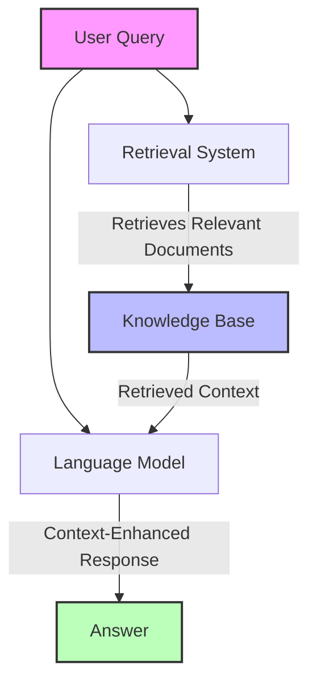
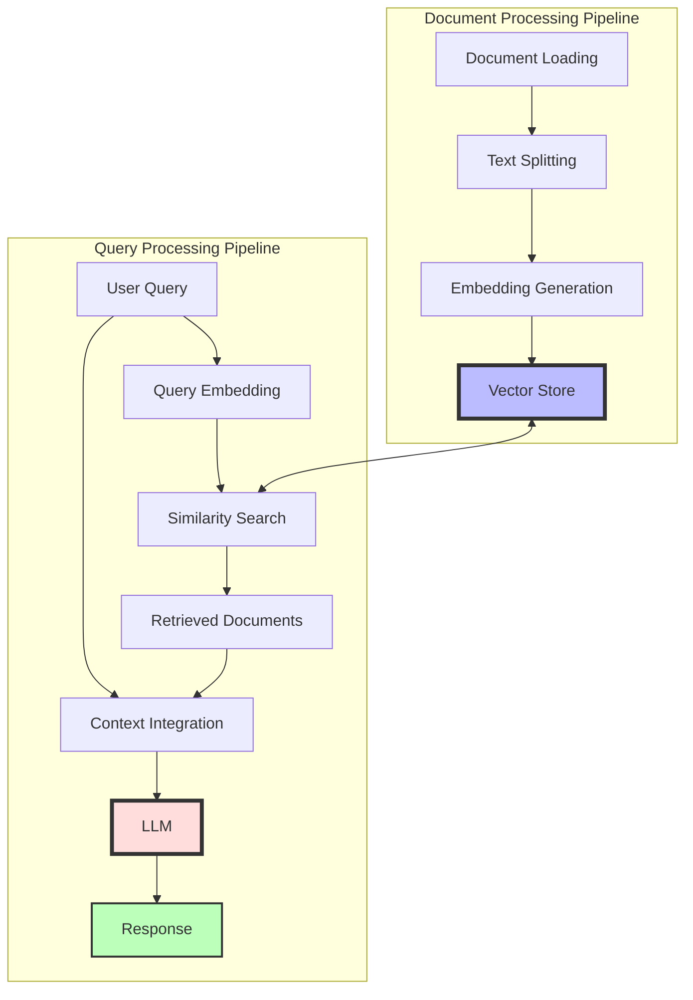
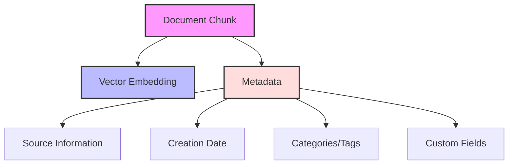
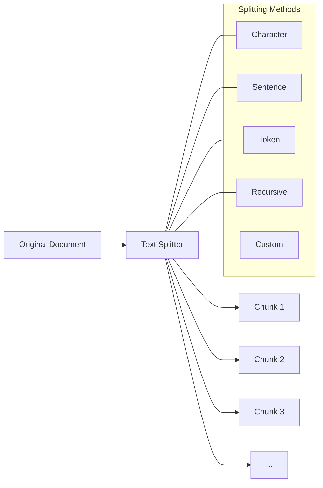
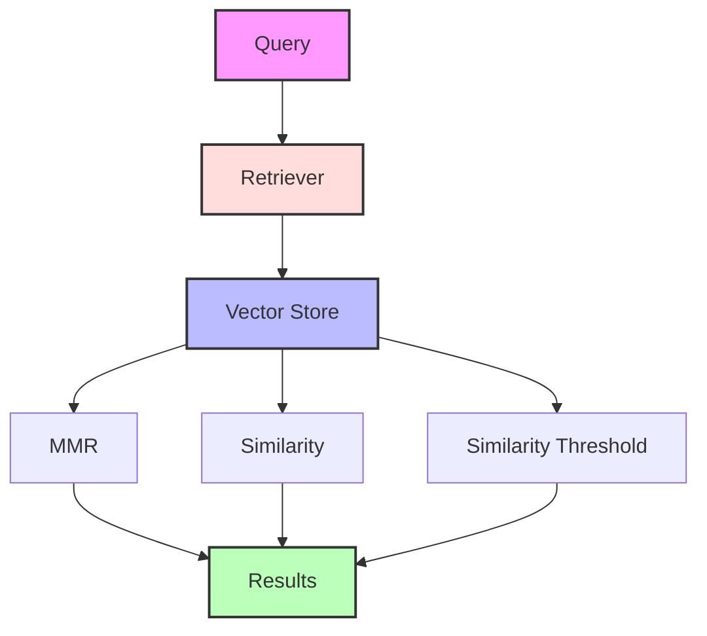
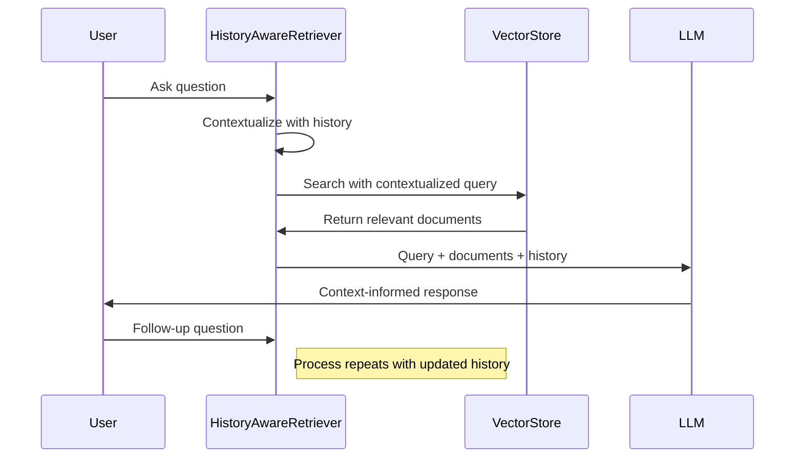
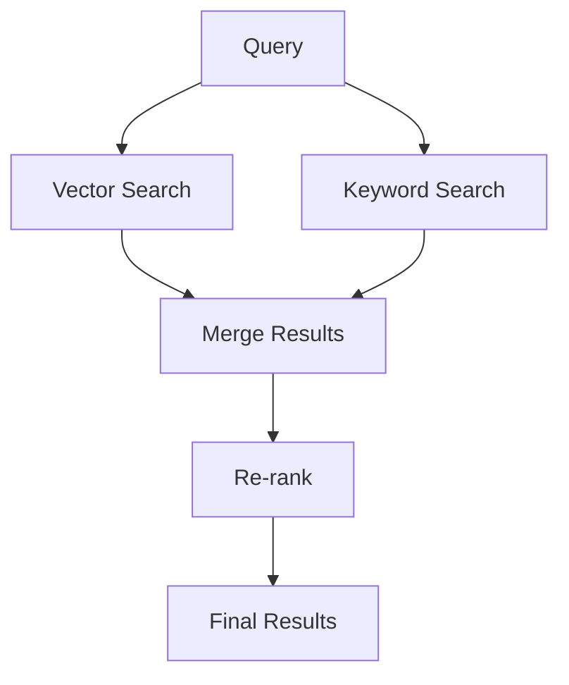
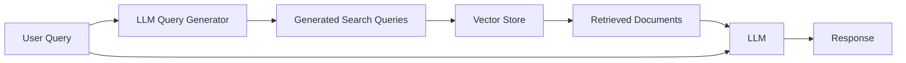
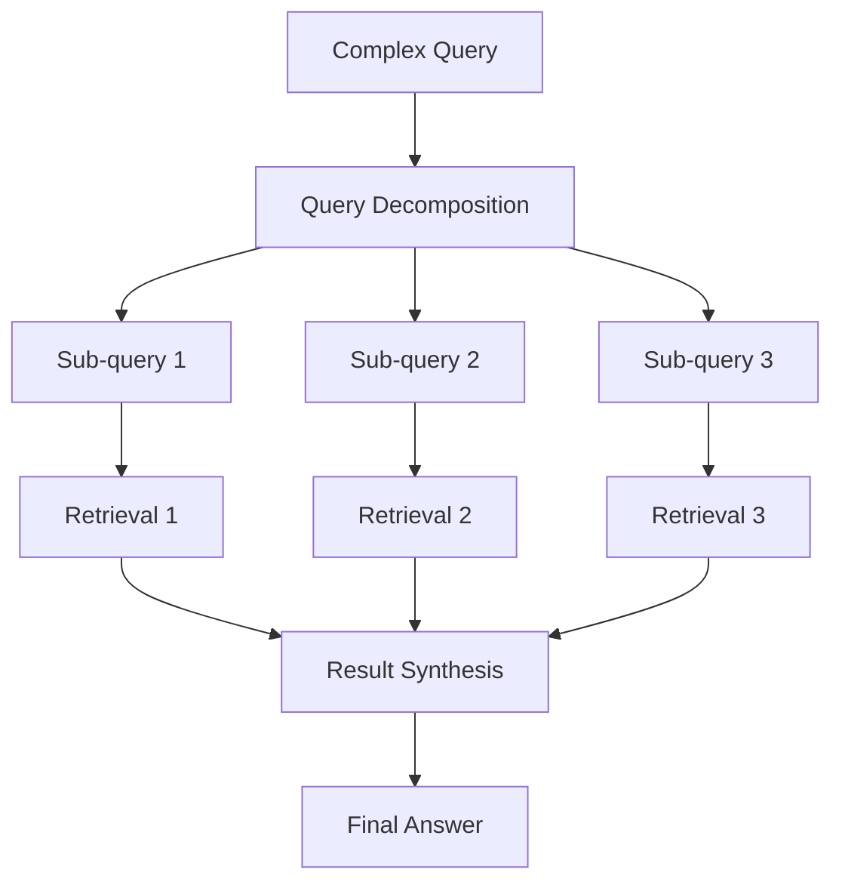

# LangChain Retrieval-Augmented Generation (RAG)

This directory contains examples demonstrating how to implement Retrieval-Augmented Generation (RAG) using LangChain. RAG is a powerful approach that combines the generative capabilities of large language models (LLMs) with the ability to retrieve relevant information from external knowledge sources.

## What is Retrieval-Augmented Generation (RAG)?

RAG is a technique that enhances the capabilities of large language models by giving them access to relevant information from an external knowledge base. Instead of relying solely on the model's internal parameters for generating responses, RAG supplements the model with contextually relevant information retrieved from a corpus of documents.



## Why Use RAG?

RAG addresses several limitations of traditional language models:

1. **Up-to-date Information**: LLMs are trained on data up to a cutoff date and cannot access new information. RAG enables access to current data.

2. **Domain-Specific Knowledge**: RAG can draw from specialized knowledge bases, enhancing performance in specific domains.

3. **Verifiability**: Responses can be traced back to source documents, making claims verifiable.

4. **Reduced Hallucinations**: By grounding responses in retrieved facts, RAG reduces the tendency of LLMs to generate plausible-sounding but incorrect information.

5. **Customizability**: You can tailor the knowledge base to your specific needs without retraining the entire model.

## RAG Architecture and Components

A typical RAG system consists of the following key components:



### 1. Document Processing

- **Document Loading**: Ingesting documents from various sources (text files, PDFs, web pages)
- **Text Splitting**: Breaking documents into manageable chunks
- **Embedding Generation**: Converting text chunks into vector representations
- **Vector Storage**: Storing embeddings in a vector database for efficient retrieval

### 2. Query Processing

- **Query Embedding**: Converting the user's query into a vector representation
- **Similarity Search**: Finding document chunks most similar to the query
- **Context Integration**: Combining the query with retrieved information
- **LLM Response Generation**: Generating a response based on the query and retrieved context

## Examples in this Directory

### 1. RAG Basics (`1a_rag_basics.py` & `1b_rag_basics.py`)

These scripts demonstrate the fundamental RAG workflow:

- Loading and processing documents
- Creating vector embeddings
- Storing embeddings in a vector database
- Performing similarity searches to retrieve relevant information

```python
# Create embeddings and store them
embeddings = GoogleGenerativeAIEmbeddings(model="models/embedding-001")
db = Chroma.from_documents(docs, embeddings, persist_directory=persistent_directory)

# Retrieve relevant documents
retriever = db.as_retriever(search_type="similarity_score_threshold")
relevant_docs = retriever.invoke(query)
```

### 2. RAG with Metadata (`2a_rag_basics_metadata.py` & `2b_rag_basics_metadata.py`)

Shows how to enhance RAG by incorporating metadata with documents:

- Adding metadata to document chunks
- Filtering searches based on metadata
- Using metadata to improve retrieval relevance



### 3. Text Splitting Deep Dive (`3_rag_text_splitting_deep_dive.py`)

Explores various text splitting techniques and their impact on retrieval quality:

- Character-based splitting
- Sentence-based splitting
- Token-based splitting
- Recursive character-based splitting
- Custom splitting logic



### 4. Embedding Deep Dive (`4_rag_embedding_deep_dive.py`)

Demonstrates different embedding models and techniques:

- Comparing embedding models
- Understanding embedding dimensions
- Evaluating embedding quality for retrieval

### 5. Retriever Deep Dive (`5_rag_retriever_deep_dive.py`)

Explores advanced retrieval strategies:

- Similarity search methods
- Score thresholds
- Hybrid search techniques
- Re-ranking approaches



### 6. One-Off Questions (`6_rag_one_off_question.py`)

Demonstrates how to use RAG for answering individual questions:

- Retrieving relevant context for a specific query
- Constructing a prompt with retrieved information
- Generating contextually relevant answers

### 7. Conversational RAG (`7_rag_conversational.py`)

Shows how to implement RAG in a conversational context:

- Maintaining conversation history
- Creating history-aware retrievers
- Contextualizing questions based on previous interactions



### 8. Web Scraping for RAG (`8_rag_web_scrape_basic.py` & `8_rag_web_scrape_firecrawl.py`)

Demonstrates how to build a knowledge base from web content:

- Crawling web pages
- Extracting relevant content
- Processing and storing web-based information
- Querying information from web sources

## RAG Implementation Patterns

```mermaid
graph TD
    subgraph "Basic RAG"
        A1["Query"] --> B1["Retrieve"]
        B1 --> C1["Generate"]
    end

    subgraph "Advanced RAG"
        A2["Query"] --> B2["Query Transformation"]
        B2 --> C2["Multi-Index Retrieval"]
        C2 --> D2["Re-ranking"]
        D2 --> E2["Contextual Compression"]
        E2 --> F2["Generation with Citations"]
    end

    subgraph "Conversational RAG"
        A3["User Query"] --> B3["History Analysis"]
        B3 --> C3["Context-Aware Retrieval"]
        C3 --> D3["Memory Integration"]
        D3 --> E3["Contextual Response"]
    end
```



### Key Design Considerations

1. **Chunk Size**: Balancing information density with relevance

   - Smaller chunks: More precise retrieval but may lack context
   - Larger chunks: More context but potentially lower relevance

2. **Embedding Models**: Selecting appropriate embedding models for your content

   - Consider domain specificity, dimensionality, and performance

3. **Retrieval Methods**: Choosing the right search approach

   - Similarity search for basic retrieval
   - Hybrid search for combining keyword and semantic matching
   - Re-ranking for improving precision

4. **Context Window Management**: Effectively handling the LLM's context window limitations
   - Prioritizing most relevant information
   - Summarizing or filtering retrieved content

## Advanced RAG Techniques

### Hybrid Search

Combining vector search with traditional keyword search:



### Self-Querying RAG

Letting the LLM generate effective search queries:



### Multi-step RAG

Breaking complex queries into sub-queries:



## Getting Started

To run these examples:

1. Install the required packages:

   ```bash
   pip install langchain langchain-google-genai langchain-community langchain-chroma python-dotenv
   ```

2. Set up environment variables in a `.env` file:

   ```
   GOOGLE_API_KEY=your_google_api_key_here
   ```

3. Prepare your document corpus:

   - Place text files in the `books/` directory
   - Or use the web scraping examples to build a corpus from websites

4. Run the examples in sequence:
   ```bash
   python 1a_rag_basics.py
   python 1b_rag_basics.py
   ```

## Best Practices

1. **Content Quality**: Ensure your knowledge base contains high-quality, relevant information
2. **Regular Updates**: Keep your vector store updated with current information
3. **Performance Monitoring**: Track retrieval quality and adjust parameters accordingly
4. **Prompt Engineering**: Design effective prompts for context integration
5. **Evaluation**: Develop metrics to evaluate RAG performance (relevance, accuracy, etc.)

## Limitations and Challenges

1. **Context Window Constraints**: LLMs have limited context windows, restricting how much retrieved information can be used
2. **Retrieval Quality**: The system is only as good as its ability to retrieve relevant information
3. **Knowledge Base Coverage**: Incomplete knowledge bases can lead to gaps in responses
4. **Computational Costs**: Vector searches and embedding generation can be resource-intensive
5. **Hallucinations**: Even with retrieved context, LLMs may still generate incorrect information
