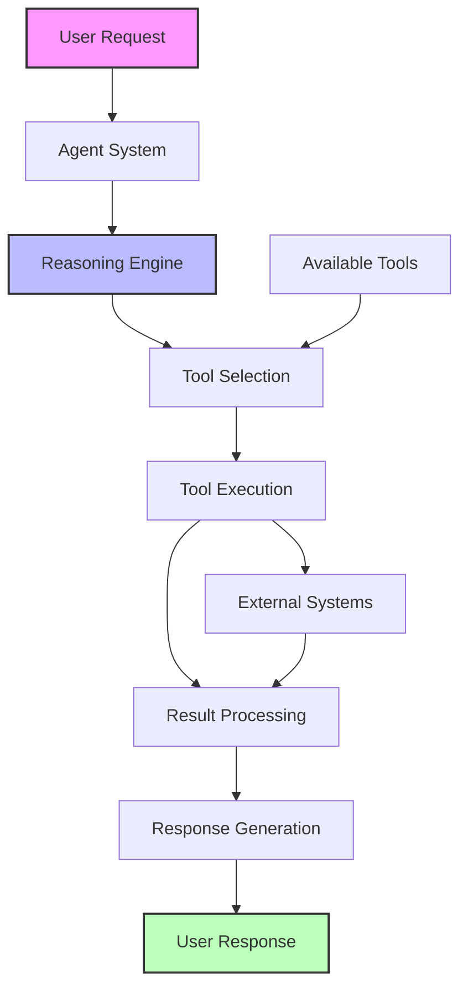
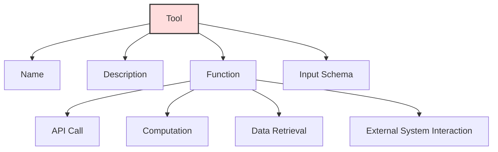
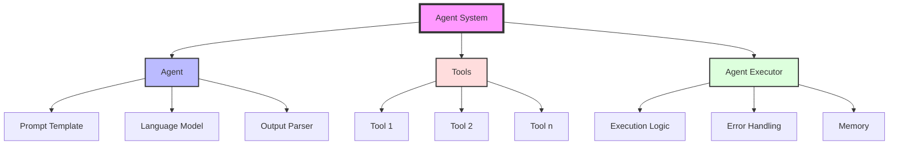
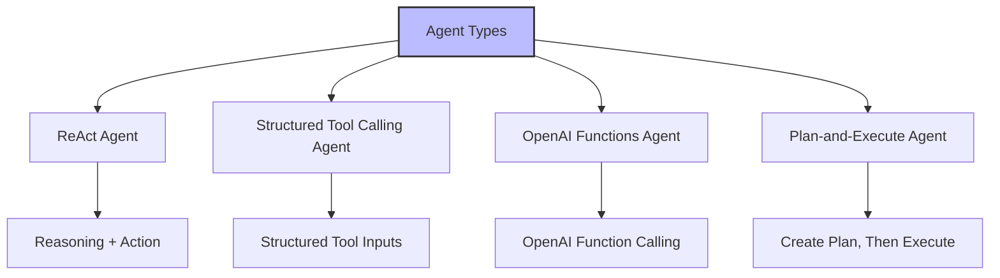
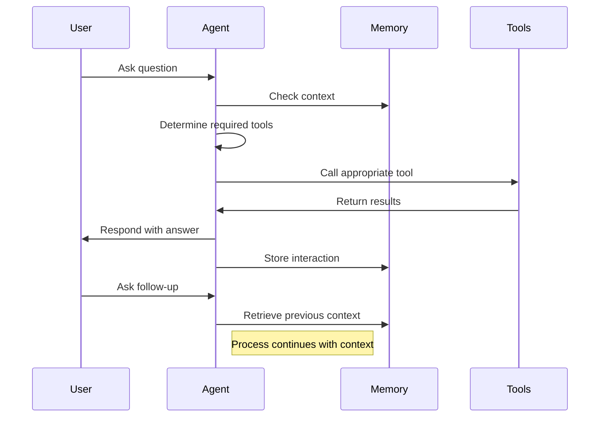
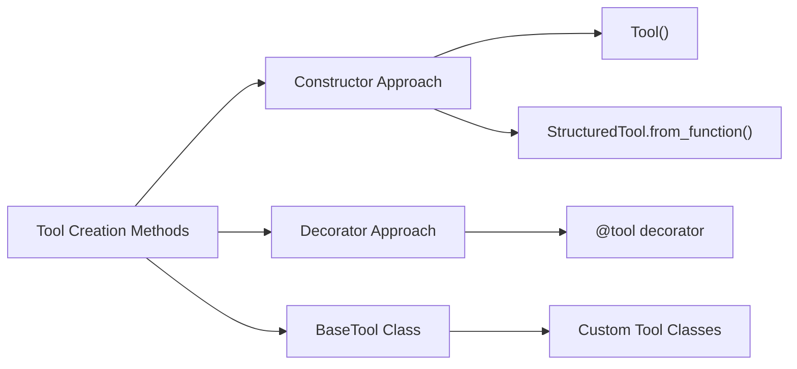
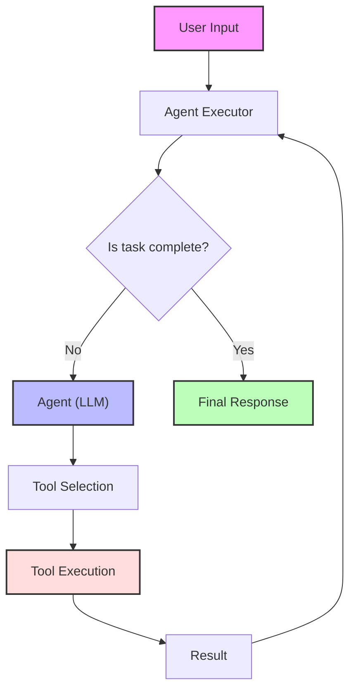
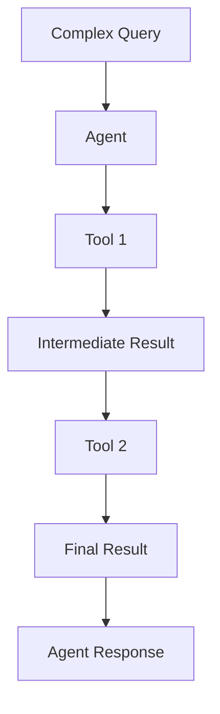

# LangChain Agents and Tools

This directory contains examples demonstrating how to implement AI agents and tools using LangChain. These examples showcase how to create intelligent systems that can reason about problems, decide which tools to use, and execute actions to accomplish tasks.

## What are LangChain Agents?

Agents are autonomous systems that use language models (LLMs) to determine which actions to take and in what order. They can interact with tools, process information, make decisions, and solve complex problems by reasoning through a sequence of steps.



## What are LangChain Tools?

Tools are functions that agents can call to interact with the world, access external systems, or perform specific operations. They provide agents with capabilities beyond what's possible with just a language model.



## Why Use Agents and Tools?

Agents and tools extend the capabilities of language models in several ways:

1. **Task Automation**: Automate complex workflows by combining reasoning with action.
2. **System Integration**: Connect LLMs to external APIs, databases, and services.
3. **Reasoning with Feedback**: Enable iterative problem-solving based on results from tool calls.
4. **Dynamic Decision-Making**: Let AI systems choose the appropriate tools based on the context.
5. **State Management**: Maintain context across multiple steps of a complex operation.

## Key Components of LangChain Agents



### 1. Agent

The agent component is responsible for determining which actions to take. It consists of:

- **Prompt Template**: Defines how to structure the input to the LLM
- **Language Model**: The underlying AI model that generates actions
- **Output Parser**: Converts the LLM's output into a structured format for tool execution

### 2. Tools

Tools are functions that the agent can use to perform operations. Each tool has:

- **Name**: A unique identifier for the tool
- **Description**: Helps the agent understand when to use the tool
- **Function**: The actual code that executes when the tool is called
- **Input Schema** (optional): Defines the expected inputs for the tool

### 3. Agent Executor

The executor manages the interaction between the agent and tools. It handles:

- **Execution Logic**: Controls the flow of the agent-tools interaction
- **Error Handling**: Manages failures gracefully
- **Memory**: Maintains context across multiple steps

## Agent Types in LangChain

LangChain supports several agent types, each with different reasoning patterns:



- **ReAct Agent**: Uses the Reasoning + Action pattern, explicitly reasoning about each step
- **Structured Tool Calling Agent**: Uses structured formats for tool inputs
- **OpenAI Functions Agent**: Utilizes the function calling capabilities of certain models
- **Plan-and-Execute Agent**: First creates a plan, then executes each step

## Examples in this Directory

### 1. Agent and Tools Basics (`1_agent_and_tools_basics.py`)

Demonstrates the simplest implementation of a ReAct agent with a time tool:

```python
# Define a tool
tools = [
    Tool(
        name="Time",
        func=get_current_time,
        description="Useful for when you need to know the current time",
    ),
]

# Create the agent
agent = create_react_agent(llm=llm, tools=tools, prompt=prompt)

# Execute the agent
agent_executor = AgentExecutor.from_agent_and_tools(agent=agent, tools=tools)
response = agent_executor.invoke({"input": "What time is it?"})
```

This example shows:

- How to define a simple tool
- How to create a ReAct agent
- How to execute the agent with a query

### 2. Agent Deep Dive

#### ReAct Chat Agent (`agent_deep_dive/1_agent_react_chat.py`)

Shows how to create an interactive chat agent with memory:



Key features:

- Conversation memory management
- Multiple tools (Time and Wikipedia)
- Interactive chat loop

#### ReAct DocStore Agent (`agent_deep_dive/2_agent_react_docstore.py`)

Demonstrates an agent that can interact with a document store:

- Creates a simple document retrieval system
- Shows how agents can work with structured knowledge bases
- Enables question answering over document collections

### 3. Tools Deep Dive



#### Tool Constructor (`tools_deep_dive/1_tool_constructor.py`)

Shows how to create tools using the constructor approach:

```python
# Simple tool with a single parameter
Tool(
    name="GreetUser",
    func=greet_user,
    description="Greets the user by name.",
)

# Structured tool with multiple parameters
StructuredTool.from_function(
    func=concatenate_strings,
    name="ConcatenateStrings",
    description="Concatenates two strings.",
)
```

This example demonstrates:

- Simple tools with the `Tool` constructor
- Complex tools with multiple parameters using `StructuredTool`

#### Tool Decorator (`tools_deep_dive/2_tool_decorator.py`)

Shows how to create tools using the decorator approach:

```python
@tool
def greet_user(name: str) -> str:
    """Greets the user by name."""
    return f"Hello, {name}!"
```

This example demonstrates:

- Using decorators for cleaner tool definitions
- Type hints for input validation

#### BaseTool Class (`tools_deep_dive/3_tool_base_tool.py`)

Shows how to create custom tool classes:

```python
class CalculatorTool(BaseTool):
    name = "Calculator"
    description = "Useful for performing mathematical calculations."

    def _run(self, expression: str) -> str:
        try:
            return str(eval(expression))
        except Exception as e:
            return f"Error in calculation: {str(e)}"
```

This example demonstrates:

- Creating custom tool classes with `BaseTool`
- Implementing error handling
- Creating more complex tool behavior

## Agent Execution Flow



The agent execution process follows these steps:

1. User provides an input to the agent
2. Agent executor manages the execution flow
3. Agent (LLM) decides which action to take:
   - Choose a tool to execute
   - Generate a final answer
4. If a tool is chosen, execute it and return to step 2
5. If the task is complete, return the final answer

## Advanced Agent Concepts

### Agent Memory

Agents can maintain memory across conversational turns:

```python
memory = ConversationBufferMemory(memory_key="chat_history", return_messages=True)
agent_executor = AgentExecutor.from_agent_and_tools(
    agent=agent, tools=tools, memory=memory
)
```

### Handling Errors

Agents can be configured to handle errors gracefully:

```python
agent_executor = AgentExecutor.from_agent_and_tools(
    agent=agent, tools=tools, handle_parsing_errors=True
)
```

### Tool Chaining

Agents can compose multiple tools to solve complex problems:



## Getting Started

To run these examples:

1. Install the required packages:

   ```bash
   pip install langchain langchain-google-genai python-dotenv wikipedia
   ```

2. Set up environment variables in a `.env` file:

   ```
   GOOGLE_API_KEY=your_google_api_key_here
   ```

3. Run any example:
   ```bash
   python 1_agent_and_tools_basics.py
   ```

## Best Practices

1. **Clear Tool Descriptions**: Write detailed descriptions for tools so the agent knows when to use them
2. **Error Handling**: Always include error handling in tools and agent executors
3. **Type Hints**: Use type hints for tool parameters to ensure proper validation
4. **Memory Management**: Use appropriate memory types for your use case
5. **Testing**: Test tools individually before integrating them with agents
6. **Monitoring**: Log agent actions and tool calls for debugging

## Limitations and Considerations

1. **Hallucination Risk**: Agents might try to use tools that don't exist or use tools incorrectly
2. **Performance Overhead**: Multi-step reasoning increases latency and token usage
3. **Tool Coverage**: The agent is limited by the available tools
4. **Complex Reasoning**: Some tasks require many steps of reasoning and may exceed context limits
5. **Security Concerns**: Tools can execute code and interact with external systems, requiring careful implementation

## Further Learning

1. **Tool Creation Patterns**: Explore different ways to create and organize tools
2. **Custom Agents**: Develop agents with specialized reasoning patterns
3. **Multi-Agent Systems**: Build systems where multiple agents collaborate
4. **Agent Supervision**: Implement oversight mechanisms for agent actions
