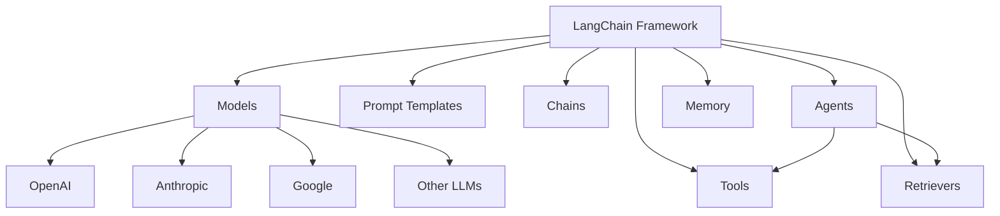
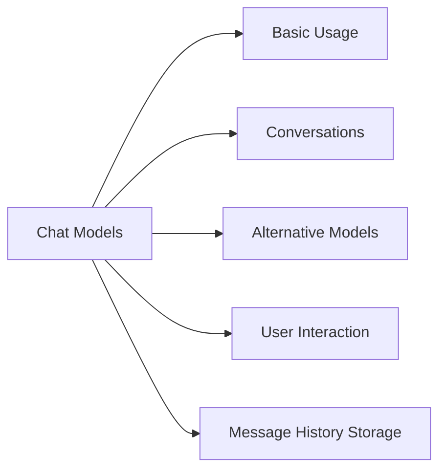
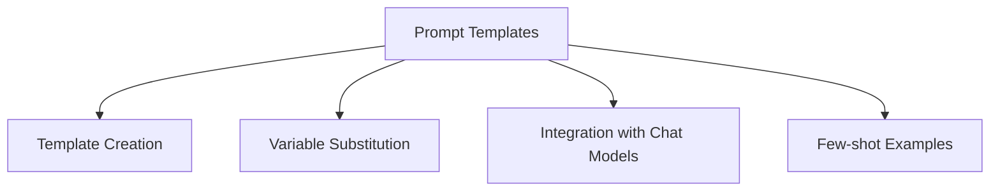
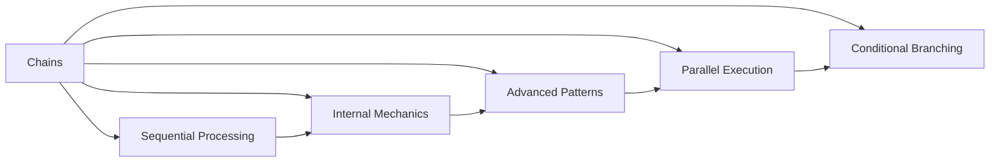
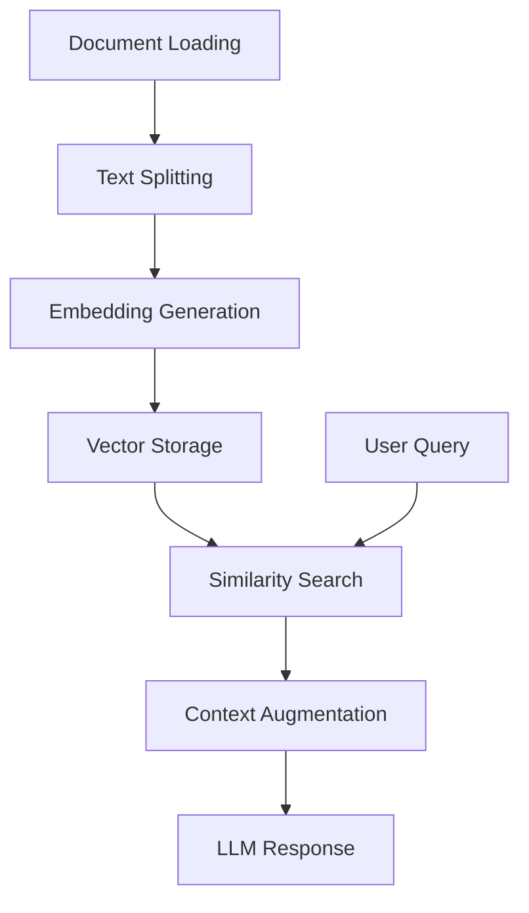
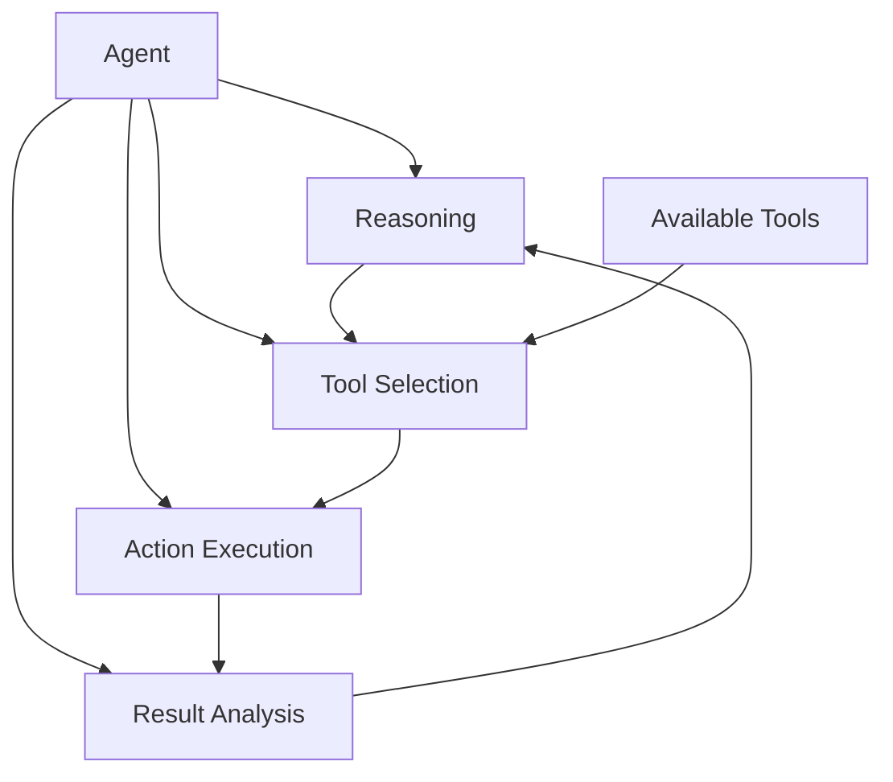
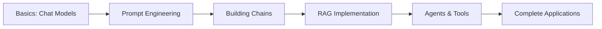

# LangChain Practical Guide

Welcome to the LangChain Crash Course repository! This repo contains all the code examples you'll need to follow along with the LangChain Master Class for Beginners video. By the end of this course, you'll know how to use LangChain to create your own AI agents, build RAG chatbots, and automate tasks with AI.

## What is LangChain?

LangChain is a framework that simplifies building applications powered by large language models (LLMs). It provides a standardized interface for chains, prompt templates, tools, agents, and memories, making LLM-powered applications more modular and easier to develop.



## Course Outline

1. **Setup Environment**: Configure your local environment to work with LangChain
2. **Chat Models**: Learn to interact with different LLMs through a unified interface
3. **Prompt Templates**: Master structured prompting techniques
4. **Chains**: Combine models and prompts into reusable pipelines
5. **RAG (Retrieval-Augmented Generation)**: Enhance LLM responses with external knowledge
6. **Agents & Tools**: Create autonomous AI systems that can use tools to accomplish tasks

## Getting Started

### Prerequisites

- Python 3.11
- Poetry (Follow this [Poetry installation tutorial](https://python-poetry.org/docs/#installation) to install Poetry on your system)

### Installation

1. Clone the repository:

   ```bash
   git clone https://github.com/bibekgupta3333/ai-crash-course
   cd ai-crash-course
   ```

2. Install dependencies using Poetry:

   ```bash
   poetry install --no-root
   ```

3. Set up your environment variables:

   - Rename the `.env.example` file to `.env` and update the variables inside with your own values. Example:

   ```bash
   mv .env.example .env
   ```

4. Activate the Poetry shell to run the examples:

   ```bash
   poetry shell
   ```

5. Run the code examples:

   ```bash
    python 1_chat_models/1_chat_model_basic.py
   ```

## Repository Structure

Here's a breakdown of the folders and what you'll find in each:

### 1. Chat Models



- `1_chat_model_basic.py`: Introduction to calling LLMs
- `2_chat_model_basic_conversation.py`: Managing multi-turn conversations
- `3_chat_model_alternatives.py`: Exploring different providers (OpenAI, Anthropic, Google)
- `4_chat_model_conversation_with_user.py`: Interactive chat applications
- `5_chat_model_save_message_history_firestore.py`: Persisting conversations to databases

Learn how to interact with models like ChatGPT, Claude, and Gemini through a unified interface.

### 2. Prompt Templates



- `1_prompt_template_basic.py`: Creating reusable prompt structures
- `2_prompt_template_with_chat_model.py`: Combining templates with chat models

Understand how to systematically design prompts with variables that can be filled in at runtime.

### 3. Chains



- `1_chains_basics.py`: Fundamentals of chaining operations
- `2_chains_under_the_hood.py`: Understanding the internal mechanisms
- `3_chains_extended.py`: Advanced chain patterns
- `4_chains_parallel.py`: Running multiple operations simultaneously
- `5_chains_branching.py`: Creating chains with decision points

Learn how to compose complex workflows by connecting models, prompts, and other components in sequence.

### 4. RAG (Retrieval-Augmented Generation)



- `1a_rag_basics.py` & `1b_rag_basics.py`: Core RAG concepts and implementation
- `2a_rag_basics_metadata.py` & `2b_rag_basics_metadata.py`: Using metadata to enhance retrieval
- `3_rag_text_splitting_deep_dive.py`: Advanced document chunking strategies
- `4_rag_embedding_deep_dive.py`: Understanding vector embeddings
- `5_rag_retriever_deep_dive.py`: Fine-tuning retrieval mechanisms
- `6_rag_one_off_question.py`: Single-query RAG implementation
- `7_rag_conversational.py`: Chat systems with context retention
- `8_rag_web_scrape_firecrawl.py` & `8_rag_web_scrape.py`: Building knowledge bases from web content

Explore how to enhance LLM responses by incorporating relevant information from external documents, websites, or databases.

### 5. Agents & Tools



- `1_agent_and_tools_basics.py`: Introduction to autonomous AI systems
- `agent_deep_dive/`:
  - `1_agent_react_chat.py`: ReAct pattern for reasoning with chat models
  - `2_react_docstore.py`: Agents that can search document collections
- `tools_deep_dive/`:
  - `1_tool_constructor.py`: Creating tools with the constructor approach
  - `2_tool_decorator.py`: Using decorators to define tools
  - `3_tool_base_tool.py`: Building tools by extending the BaseTool class

Learn how to create systems that can reason about what actions to take, use tools to gather information or perform tasks, and make decisions based on outcomes.

## How to Use This Repository

1. **Watch the Video:** Start by watching the LangChain Master Class for Beginners video on YouTube at 2X speed for a high-level overview.

2. **Run the Code Examples:** Follow along with the code examples provided in this repository. Each section in the video corresponds to a folder in this repo.

3. **Experiment and Adapt:** Modify the examples to explore different parameters, models, or use cases relevant to your projects.

## Learning Path



For optimal learning, follow the numbered folders in sequence, as each builds upon concepts introduced in the previous sections.

## Comprehensive Documentation

Each script in this repository contains detailed comments explaining the purpose and functionality of the code. This will help you understand the flow and logic behind each example.

## FAQ

**Q: What is LangChain?**  
A: LangChain is a framework designed to simplify the process of building applications that utilize language models. It provides abstractions for working with LLMs, prompts, chains, agents, memory systems, and tools.

**Q: How do I set up my environment?**  
A: Follow the instructions in the "Getting Started" section above. Ensure you have Python 3.11 installed, install Poetry, clone the repository, install dependencies, rename the `.env.example` file to `.env`, and activate the Poetry shell.

**Q: Which LLM provider should I use?**  
A: The examples work with multiple providers (OpenAI, Anthropic, Google). Choose based on your needs for cost, capabilities, and data privacy requirements.

**Q: I am getting an error when running the examples. What should I do?**  
A: Ensure all dependencies are installed correctly and your environment variables are set up properly. If the issue persists, seek help in the Skool community or open an issue on GitHub.

**Q: Can I contribute to this repository?**  
A: Yes! Contributions are welcome. Please open an issue or submit a pull request with your changes.

**Q: Where can I find more information about LangChain?**  
A: Check out the [official LangChain documentation](https://python.langchain.com/docs/get_started/introduction) and join the Skool community for additional resources and support.

## License

This project is licensed under the MIT License.
